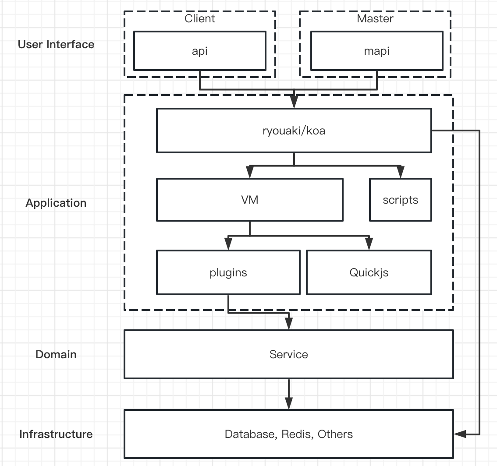

# GoCF 

GoCF is a Golang Cloud Function Engine with Quickjs. Used for Business Gateway with JavaScript.

## GoCF Architecture

GoCF has three modules:
- mapi for master to push new api or modify exist api.
- api is generated by script which upload by mapi.
- vm which build with Quickjs
- plugins which can be golang code invoked by JS



## How to use

initalize the GoCF project:
```sh
  $ cd /the path of source code of GoCF
  $ ./build.sh // for develop use ./init.sh
  $ ./bin/gocf -n [number of vm] -p [path of local dir for cache script] -h [the host of master]
```

## Mapi
there 3 api for master. 
- Get /mapi/check for heath check
- Post /mapi/restart for restart vm or reset vm.
- Post /mapi/scripts for upload new script or replace old script to build new api.

### example
```sh
  # Request
  curl --location 'localhost:8000/mapi/scripts' \
  --header 'Content-Type: application/json' \
  --data '{
      "files":[
          {
              "path": "api/get.a.js",
              "script": "export default async function exec() {return {error: false, data: '\''Hello World'\''};};"
          }
      ]
  }'
  # Response
  {
    "error": false,
    "msg": "",
    "data":"Sucess"
  }
```


## api
GoCF will generate api by the scripts which mapi upload with api url from path field.

So we can request the url /api/a and get the response like below:
```sh
  # Request
  curl --location 'localhost:8000/api/a'
  # Response
  {
    "data": "Hello World",
    "error": false
  }
```

## Plugins
```go
  // plugins/xxx.go
  plugins := make([]*gocf.Plugin, 0, 1)
	plugin := makePlugin("xx", func(args []*gocf.JSValue, this *gocf.JSValue) *gocf.JSValue {
		// do something
		return // something to JS
	})

	plugins = append(plugins, plugin)
  return plugins

  // plugins/index.go
  gocf.RegistPlugin("xxx", xxx())
```

```js
  // call on js side
  xxx.xx()
```

## License

Apache License
